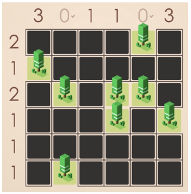

# 🏕️ Tents-And-Trees 🌲

A Prolog implementation of the classic Tents and Trees puzzle game.

## 🌳 Puzzle Tents and Trees

Tents and Trees is a logic puzzle game where you must place tents on a grid according to specific rules. Each tree must have exactly one tent adjacent to it (horizontally or vertically), and tents cannot be adjacent to each other (including diagonally).

🎮 **Want to try playing first?** You can play online [here](https://www.puzzle-tents.com/).

## 🎯 Game Rules

The rules of Tents are simple:

- **Pair each tree with a tent** adjacent horizontally or vertically. This should be a 1 to 1 relation.
- **Tents never touch each other** even diagonally
- **The clues outside the grid** indicate the number of tents on that row/column.

## 🔍 Example

Here’s a simple example of an initial puzzle:



## 🧩 Board Representation

Solutions use the following symbols:

- `a`: Tree (given in puzzle)
- `t`: Tent (to be placed)
- `r`: Grass/empty space

During the solving process, you may also see `_` representing an unassigned cell, but in the final solution only `a`, `t`, and `r` appear.

## 🔧 How to Run

### ✅ 1. Check SWI-Prolog Installation

Make sure you have **SWI-Prolog** installed.

#### On Linux (including WSL):

To verify, open your terminal and run:

```bash
swipl --version
```

If not installed, you can run:

```bash
sudo apt install swi-prolog-core
```

#### On macOS:

Check installation with:

```bash
swipl --version
```

If not installed, you can either:

- Use [Homebrew](https://brew.sh/):
  ```bash
  brew install swi-prolog
  ```
- Or download the installer directly from the [SWI-Prolog website](https://www.swi-prolog.org/Download.html) and follow the instructions.

#### On Windows:

Download the SWI-Prolog installer from the [official website](https://www.swi-prolog.org/Download.html) and follow the installation instructions. After installing, open Command Prompt and run:

```cmd
swipl --version
```

### ✅ 2. Run the Program

Once SWI-Prolog is installed, you can run the program using the following steps:

1. **Start SWI-Prolog**:

   ```bash
   swipl
   ```

2. **Load the program**:

   ```prolog
   ?- ['projeto.pl'].
   ```

   This will return `true` if the file is loaded successfully.

3. **Solve a puzzle**:

   ```prolog
   ?- puzzle(6-13, P), resolve(P).
   ```

   Puzzles are defined in the file `puzzlesAcampar.pl`. You can explore or add new ones there.

   This is what the output will look like:

   ```prolog
   P =  ([[t,r,r,r,a,t],[a,r,r,t,r,a],[r,r,r,a,r,t],[r,r,t,r,a,r],[r,r,a,r,t,r],[r,t,a,r,r,r]],[2,1,1,1,1,1],[1,1,1,1,1,2]).
   ```

## 📄 Project Description

You can find the full project description [here](projectoLP_Acampar.pdf).
